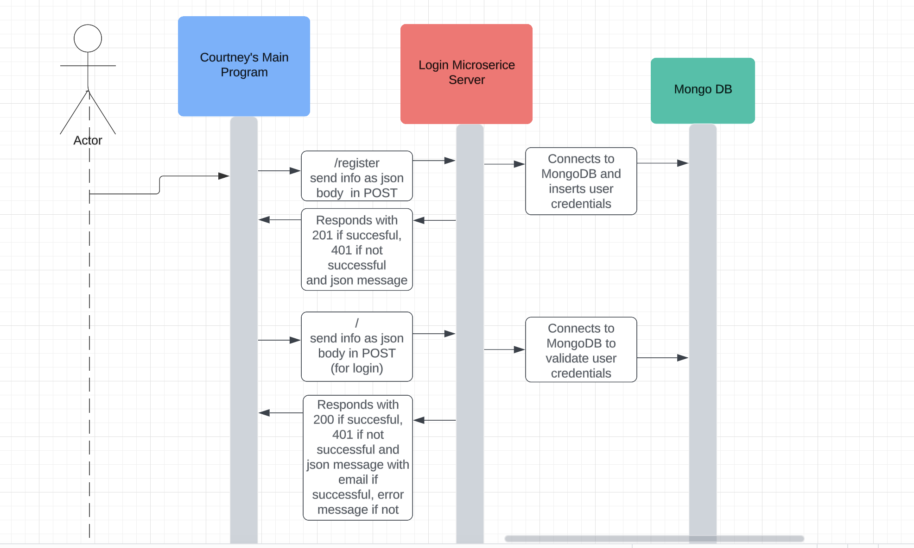

# Login Microservice

This is a simple Python/Flask login server using MongoDB. 

You will need to edit app.py to include your login uri (on line 7) for your Mongo DB. 

This app.py also assumes you have a DB and collection named 'users'. If you have named yours differently, you will need to edit. 

You start it by using the command

`python3 app.py`

This will start a server on port 9005.

You can then open another terminal window to run the sample test CURL script to register (also included in test.sh).

`
curl -X POST -H "Content-type: application/json" -d '{"name" : "John", "email" : "john@test.com", "password" : "1234"}' http://127.0.0.1:9005/register
`

There is also a sample test CURL script to login.

`
curl -X POST -H "Content-type: application/json" -d '{"email" : "john@test.com", "password" : "1234"}' http://127.0.0.1:9005/
`

You may also create your own server (on a different port) to hit this server with a POST and the json needed. Sample json are included with required fields in this repo. 

A response will be sent as json. A successful response to the register endpoint:

`
{
  "message": "Registration successful. You can now log in."
}
`

A successful response to the login endpoint:

`
{
  "email": "john@test.com",
  "message": "Login successful."
}
`

